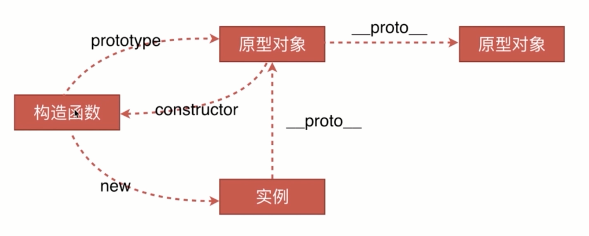

### mergeOptions
打开mergeOptions来源文件/core/util/options.js
```js
vm.$options = mergeOptions(
    resolveConstructorOptions(vm.constructor),
    options || {},
    vm
)

```
对照这看



```js
// resolveConstructorOptions
export function resolveConstructorOptions (Ctor: Class<Component>) {
  let options = Ctor.options
  // 当Vue子类实例化时触发
  if (Ctor.super) {
  //  代码省略
  }
  return options
}

```
由resolveConstructorOptions函数名就可猜想出起作用，无非解析构造者Options参数
其中vm.constructor即
```js
function Vue (options) {
  if (!(this instanceof Vue)
  ) {
    warn('Vue is a constructor and should be called with the `new` keyword');
  }
  this._init(options);
}
```

Ctor.super判断是否是子类，如 Vue.extend()， 当前只是vue实例，故而只会走else分支
返回options，根据之前的分析，此处当为
```js
Vue.options = {
	components: {
		KeepAlive
		Transition,
    	TransitionGroup
	},
	directives:{
	    model,
        show
	},
	filters: Object.create(null),
	_base: Vue
}
```

第二个参数即为实例化时传过来的参数
```js
{
  el: '#app',
  data: {
      test: 1
  }
}
```
第三个参数即为vm

```js
vm.$options = mergeOptions(
  // resolveConstructorOptions(vm.constructor)
  {
    components: {
      KeepAlive
      Transition,
      TransitionGroup
    },
    directives:{
      model,
      show
    },
    filters: Object.create(null),
    _base: Vue
  },
  // options || {}
  {
    el: '#app',
    data: {
      test: 1
    }
  },
  vm
)
```


看看mergeOptions方法
```js
/**
 * Merge two option objects into a new one.
 * Core utility used in both instantiation and inheritance.
 */
export function mergeOptions (
  parent: Object,
  child: Object,
  vm?: Component
): Object {
  if (process.env.NODE_ENV !== 'production') {
    checkComponents(child)
  }

  if (typeof child === 'function') {
    child = child.options
  }

  normalizeProps(child, vm)
  normalizeInject(child, vm)
  normalizeDirectives(child)
  
  // Apply extends and mixins on the child options,
  // but only if it is a raw options object that isn't
  // the result of another mergeOptions call.
  // Only merged options has the _base property.
  if (!child._base) {
    if (child.extends) {
      parent = mergeOptions(parent, child.extends, vm)
    }
    if (child.mixins) {
      for (let i = 0, l = child.mixins.length; i < l; i++) {
        parent = mergeOptions(parent, child.mixins[i], vm)
      }
    }
  }

  const options = {}
  let key
  for (key in parent) {
    mergeField(key)
  }
  for (key in child) {
    if (!hasOwn(parent, key)) {
      mergeField(key)
    }
  }
  function mergeField (key) {
    const strat = strats[key] || defaultStrat
    options[key] = strat(parent[key], child[key], vm, key)
  }
  return options
}

```
当前函数的作用，看注释就能了解，注意参数vm，此处为可选，那就意味着mergeOptions不止在一处被调用。
方法首先以checkComponents调用参数二， 先看看checkComponents方法详情。
```js
/**
 * Validate component names
 */
function checkComponents (options: Object) {
  for (const key in options.components) {
    validateComponentName(key)
  }
}
export function validateComponentName (name: string) {
  if (!/^[a-zA-Z][\w-]*$/.test(name)) {
    warn(
      'Invalid component name: "' + name + '". Component names ' +
      'can only contain alphanumeric characters and the hyphen, ' +
      'and must start with a letter.'
    )
  }
  if (isBuiltInTag(name) || config.isReservedTag(name)) {
    warn(
      'Do not use built-in or reserved HTML elements as component ' +
      'id: ' + name
    )
  }
}
```
简言之，checkComponents作用在于检测组件名称，一组件的名字由普通的字符和中横线(-)组成，且必须以字母开头，二不能为内置标签以及config.isReservedTag定义的保留字。


```js
// 再探究
  if (typeof child === 'function') {
    child = child.options
  }
```

接下来

```js
normalizeProps(child, vm)
normalizeInject(child, vm)
normalizeDirectives(child)
```
由函数命名可猜想这三个函数作用即为规范化props、inject以及directives。
比如props将转做如下转换
```js
// 第一种写法
props: ["someData"]
// 第二种写法
props: {
  someData: null,
  someData1: {
    type: String,
    default: ''
  }
}
  ⬇️
props: {
  someData: {
    type: null
  },
  someData1: {
    type: String,
    default: ''
  }
}
```
当前只是格式规范化，默认值规则在之后的initProps在做探讨

inject的规范化
2.2.0 新增，用于祖组件向子组件传值。 参考[provide/inject](https://cn.vuejs.org/v2/api/#provide-inject)
```js
// 写法1
inject： ['data1', 'data2']
//  写法2 2.5.0新增 用于指定默认值使其变成可选项： 
//  当然此处对非原始值也需使用一个工厂方法：
inject: {
  data3: { default: () => [] }
}

⬇️

inject: {
  'data1': { from: 'data1' },
  'data2': { from: 'data2' },
  'data3': { from: 'data3', default: () => []}
}
```
为每个属性加上from属性，目的在于使用 from 来表示其源属性。

update: 
directives的规范化
```js
 // 注册两个局部指令
  directives: {
    test1: {
      bind: function () {
        console.log('v-test1')
      }
    },
    test2: function () {
      console.log('v-test2')
    }
  }
      ⬇️
options.directives = {
  test1: { bind: () => {console.log('v-test1')}},
  test2: { bind: () => {console.log('v-test2')}, update: () => {console.log('v-test2')}}
}
```
接下来
```js
// Apply extends and mixins on the child options,
// but only if it is a raw options object that isn't
// the result of another mergeOptions call.
// Only merged options has the _base property.
if (!child._base) {
  if (child.extends) {
    parent = mergeOptions(parent, child.extends, vm);
  }
  if (child.mixins) {
    for (var i = 0, l = child.mixins.length; i < l; i++) {
      parent = mergeOptions(parent, child.mixins[i], vm);
    }
  }
}
```
依照一路走下来的流程，此时断然没有child._base的，故猜想这句应该是判断子类的。
而代码块里面当时处理extends、mixins的。
TODO 补充

```js
/**
 * Default strategy.
 */
const defaultStrat = function (parentVal: any, childVal: any): any {
  return childVal === undefined
    ? parentVal
    : childVal
}


var options = {};
var key;
for (key in parent) {
  mergeField(key);
}
for (key in child) {
  if (!hasOwn(parent, key)) {
    mergeField(key);
  }
}
function mergeField (key) {
  var strat = strats[key] || defaultStrat;
  options[key] = strat(parent[key], child[key], vm, key);
}
return options
```
最后一段代码声明一个新对象最后返回这个对象，显然中间的代码无非对options的补充。
此处牵扯到当前模块全局变量strats，留作后文探讨。


